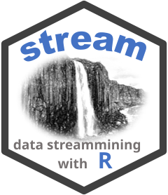
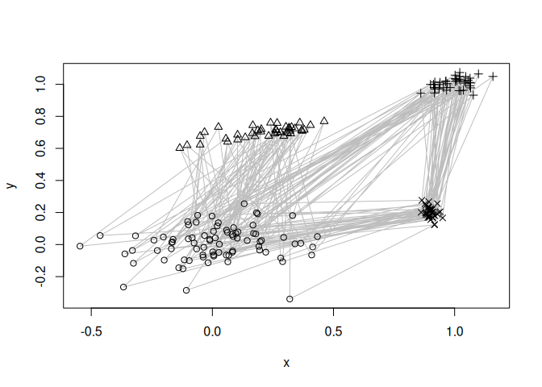
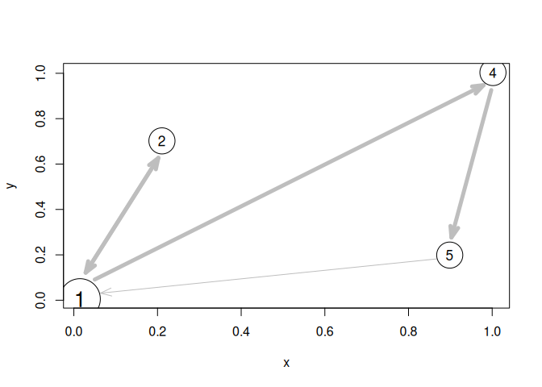

#  R package rEMM - Extensible Markov Model for Modelling Temporal Relationships Between Clusters

[](https://CRAN.R-project.org/package=rEMM)
[](https://CRAN.R-project.org/package=rEMM)
 [](https://mhahsler.r-universe.dev/rEMM)

**Maintainer:** [Michael Hahsler](https://michael.hahsler.net)

Implements TRACDS (Temporal Relationships between Clusters for Data
Streams), a generalization of the Extensible Markov Model (EMM), to
model transition probabilities in sequence data (Hahsler and Dunham
2011). TRACDS adds a temporal or order model to data stream clustering
by superimposing a dynamically adapting Markov chain. It also provides
an implementation of EMM (TRACDS on top of tNN data stream clustering)
(Hahsler and Dunham 2010).

The package also provides interface classes DSC_tNN and DSC_EMM for data
stream mining with [`stream`](https://michael.hahsler.net/stream/)
(Hahsler et al. 2017).

## Installation

**Stable CRAN version:** Install from within R with

``` r
install.packages("rEMM")
```

**Current development version:** Install from
[r-universe.](https://mhahsler.r-universe.dev/rEMM)

``` r
install.packages("rEMM",
    repos = c("https://mhahsler.r-universe.dev",
              "https://cloud.r-project.org/"))
```

## Usage

We use an artificial dataset with four clusters. Points are generated
using the fixed sequence \<1,2,1,3,4\> through the four clusters. The
lines below indicate the sequence.

``` r
library(rEMM)

data("EMMsim")

plot(EMMsim_train, pch = NA)
lines(EMMsim_train, col = "gray")
points(EMMsim_train, pch = EMMsim_sequence_train)
```

<!-- -->

EMM recovers the components and sequence information. We use EMM and
then recluster the learned structure, assuming that we know there are
four components. The graph below represents a Markov model of the
sequence.

``` r
emm <- EMM(threshold = 0.1, measure = "euclidean")
build(emm, EMMsim_train)
emmc <- recluster_hclust(emm, k = 4, method = "average")
plot(emmc, method = "MDS")
```

<!-- -->

We can now score new sequences. Here, we use a test sequence created in
the same way as the training data and calculate the product of the
transition probabilities in the model. A high score indicates a good
match.

``` r
score(emmc, EMMsim_test)
```

    ## [1] 0.71

## Vignettes

- [Getting started with
  rEMM](https://michael.hahsler.net/rEMM/articles/rEMM.html) introduces
  building, inspecting, and using an EMM.
- [Adding temporal structure modeling to standard
  clustering](https://michael.hahsler.net/rEMM/articles/TRAC.html) shows
  how to add a temporal model to clustering methods such as k-means.
- [Adding temporal structure modeling to stream
  clustering](https://michael.hahsler.net/rEMM/articles/stream.html)
  connects stream clusterers to TRACDS.

# Acknowledgements

Development of this package was supported in part by NSF IIS-0948893 and
R21HG005912 from the National Human Genome Research Institute.

# References

<div id="refs" class="references csl-bib-body hanging-indent">

<div id="ref-Hahsler:2017" class="csl-entry">

Hahsler, Michael, Matthew Bolaños, and John Forrest. 2017. “Introduction
to Stream: An Extensible Framework for Data Stream Clustering Research
with r.” *Journal of Statistical Software* 76 (14): 1–50.
<https://doi.org/10.18637/jss.v076.i14>.

</div>

<div id="ref-Hahsler+Dunham:2010" class="csl-entry">

Hahsler, Michael, and Margaret H. Dunham. 2010.
“<span class="nocase">rEMM</span>: Extensible Markov Model for Data
Stream Clustering in R.” *Journal of Statistical Software* 35 (5): 1–31.
<https://doi.org/10.18637/jss.v035.i05>.

</div>

<div id="ref-Hahsler+Dunham:2011" class="csl-entry">

Hahsler, Michael, and Margaret H. Dunham. 2011. “Temporal Structure
Learning for Clustering Massive Data Streams in Real-Time.” *Proceedings
of the 2011 SIAM International Conference on Data Mining*, 664–75.
<https://doi.org/10.1137/1.9781611972818.57>.

</div>

</div>
