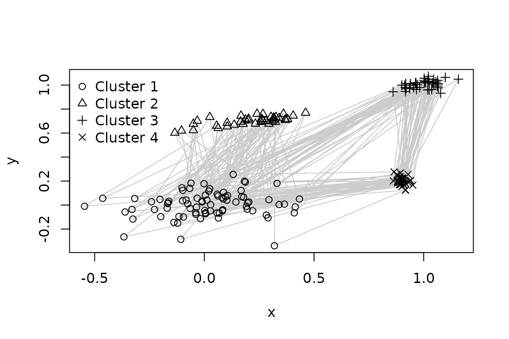
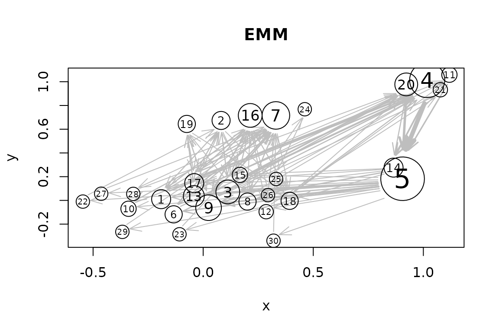
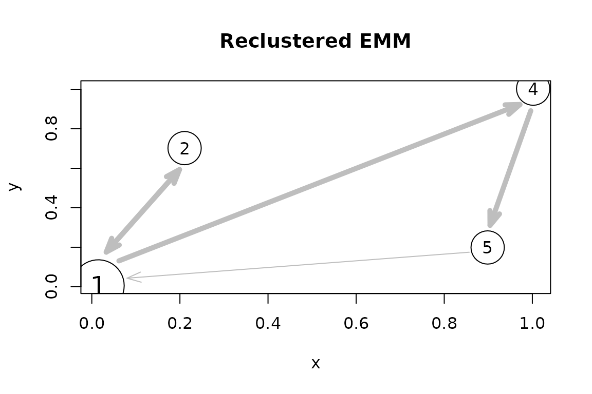

# Getting started with rEMM

## Introduction

Traditional data stream clustering algorithms efficiently group massive
real-time data points into clusters but typically disregard the
chronological or temporal order in which those points arrive. TRACDS
(Hahsler and Dunham 2011) fixes this by superimposing a dynamically
adapting Markov chain onto data stream clustering. As a data stream is
processed and partitioned into clusters, the transitions between
clusters over time are captured. The states of the Markov chain
represent the clusters, and the edges capture the probability of moving
from one cluster to another over time.

A specific implementation is the Extensible Markov Model (EMM) (Dunham
et al. 2004), which combines threshold nearest neighbor clustering with
a Markov chain. The package `rEMM` implements EMMs and also the general
TRACDS framework that can add temporal structure learning on top of any
data stream clustering algorithm. An interface for the algorithms in the
[`stream`](https://michael.hahsler.net/stream/) package (Hahsler et al.
2017) is provided.

This guide demonstrates how to build a model from an ordered sequence,
inspect its clusters and transitions, score new sequences, and predict a
future state.

## Install and load the package

Install the released package from CRAN:

``` r

install.packages("rEMM")
```

``` r

library(rEMM)
```

## Prepare an ordered sequence

Use a numeric matrix or data frame with one observation per row and one
feature per column. Rows must be in sequence order because EMM learns
transitions between consecutive rows. Choose feature scales and a
distance measure that reflect similarity in your application; for
Euclidean distance, features with larger scales can dominate the
clustering.

The included `EMMsim` data contain observations from four clusters in
two dimensions. The training sequence repeats the pattern
`1, 2, 1, 3, 4` forty times, giving 200 observations. A separate test
sequence contains 25 observations generated using the same pattern.

``` r

data("EMMsim")
dim(EMMsim_train)
#> [1] 200   2
head(EMMsim_train)
#>                x           y
#> [1,] -0.24141315  0.02774292
#> [2,]  0.02493457  0.73318465
#> [3,]  0.08582494  0.05060559
#> [4,]  1.02457305  1.02224008
#> [5,]  0.88936846  0.16892761
#> [6,] -0.09543854 -0.09983864
head(EMMsim_sequence_train, 10)
#>  [1] 1 2 1 3 4 1 2 1 3 4
```

We can visualize the training dataset as points where the different
symbols identify the generating clusters. The grey lines show the order
of observations. These cluster labels are supplied for illustration; the
model uses only the coordinates in `EMMsim_train` and needs to learn the
clusters and temporal relationship between them.

``` r

plot(EMMsim_train, type = "n", xlab = "x", ylab = "y")
lines(EMMsim_train, col = "gray80")
points(EMMsim_train, pch = EMMsim_sequence_train)
legend("topleft", legend = paste("Cluster", 1:4), pch = 1:4, bty = "n")
```



## Build and inspect an EMM

[`EMM()`](http://michael.hahsler.net/rEMM/reference/EMM-class.md)
creates an empty model.
[`build()`](http://michael.hahsler.net/rEMM/reference/build.md)
processes observations in row order, assigns them to clusters, and
records transitions between states. For the threshold nearest neighbor
clustering approach (`tNN`), a new observation joins the closest cluster
when its distance is below the clustering threshold; otherwise, it
creates a new cluster. A detailed description of how the model is
created can be found in Hahsler and Dunham (2011).

``` r

emm <- EMM(threshold = 0.1, measure = "euclidean")
build(emm, EMMsim_train)
emm
#> EMM with 30 states/clusters.
#>  Measure: euclidean 
#>  Threshold: 0.1 
#>  Centroid: TRUE 
#>  Lambda: 0
```

The threshold controls the level of detail in the clustering. Smaller
values generally produce more clusters, while larger values group more
observations together. Here, the small threshold creates micro-clusters
within the four generating clusters. The threshold is expressed in the
units of the chosen distance measure and should be chosen for the scale
of your data.

[`size()`](http://michael.hahsler.net/rEMM/reference/EMM-class.md)
returns the number of clusters,
[`cluster_centers()`](http://michael.hahsler.net/rEMM/reference/tNN-class.md)
returns their representative coordinates, and
[`cluster_counts()`](http://michael.hahsler.net/rEMM/reference/tNN-class.md)
reports how many observations have been assigned to each cluster.
[`last_clustering()`](http://michael.hahsler.net/rEMM/reference/tNN-class.md)
retains the cluster assignments of data points from the most recent
[`build()`](http://michael.hahsler.net/rEMM/reference/build.md) call.

``` r

size(emm)
#> [1] 30
head(cluster_centers(emm))
#>             x           y
#> 1 -0.19083331  0.01050197
#> 2  0.08133044  0.67363610
#> 3  0.11179032  0.07133282
#> 4  1.01746868  1.01392472
#> 5  0.90573527  0.18247363
#> 6 -0.13412975 -0.11755345
head(sort(cluster_counts(emm), decreasing = TRUE))
#>  5  4  7  9  3 16 
#> 33 24 16 14 12 12
head(last_clustering(emm), 10)
#>  [1] "1" "2" "3" "4" "5" "6" "7" "8" "4" "5"
```

The cluster labels are just identifiers and do not need to match the
labels used to generate the example data.

We can visualize the learned model. The MDS method places clusters at
the locations of their centers. For higher-dimensional data, it uses a
2D multidimensional scaling projection.

``` r

plot(emm, method = "MDS", main = "EMM")
```



We see that the clustering broke the 4 clusters each into several
micro-clusters which is common for data stream clustering algorithms.
The grey arrows show that it learned the general order.

## Simplifying the model

When a data stream clustering model has many micro-clusters,
reclustering can give a more compact view. In this example, we know
there are four generating clusters, so we merge the micro-clusters into
four groups using hierarchical clustering. For other data, choose the
number of groups using domain knowledge or validation on separate
sequences.

``` r

emm4 <- recluster_hclust(emm, k = 4, method = "average")
emm4
#> EMM with 4 states/clusters.
#>  Measure: euclidean 
#>  Threshold: 0.1 
#>  Centroid: TRUE 
#>  Lambda: 0
cluster_centers(emm4)
#>            x           y
#> 1 0.01474468 0.005505117
#> 2 0.21061897 0.702117888
#> 4 1.00185325 1.003273546
#> 5 0.89855119 0.198899869
cluster_counts(emm4)
#>  1  2  4  5 
#> 80 40 40 40
```

[`recluster_hclust()`](http://michael.hahsler.net/rEMM/reference/recluster.md)
merges both the clusters and their transition information. The
reclustered model

``` r

plot(emm4, method = "MDS", main = "Reclustered EMM")
```

 The reclustered model
perfectly learned the temporal structure of the cluster order:
bottom-left, top-left, bottom-left, top-right, bottom-right. This holds
for this simple data set. Remember, cluster labels are identifiers and
do not need to agree with the labels in the original data set.

Transition matrices have source states in rows and destination states in
columns. Transition probabilities are based on those counts. The default
`prior = TRUE` to smooth counts by adding one to every transition count
before calculating probabilities, which gives more stable results for
low counts. Here, we show the transition probabilities without count
smoothing.

``` r

transition_matrix(emm4, prior = FALSE)
#>   1   2   4 5
#> 1 0 0.5 0.5 0
#> 2 1 0.0 0.0 0
#> 4 0 0.0 0.0 1
#> 5 1 0.0 0.0 0
```

## Score a new sequence

[`score()`](http://michael.hahsler.net/rEMM/reference/score.md) measures
how well a new sequence of data points agrees with the learned model.
Points are assigned to existing clusters, and the transitions are
scored.

Here, we use `method = "product"`, which multiplies the transition
probabilities along the path taken by the new data. The score is
rescaled to a probability by accounting for the path length.

``` r

set.seed(1234)
test_shuffled <- EMMsim_test[sample(nrow(EMMsim_test)), , drop = FALSE]
c(
  ordered = score(emm4, EMMsim_test,
    method = "product", match_cluster = "nn", prior = TRUE),
  shuffled = score(emm4, test_shuffled,
    method = "product", match_cluster = "nn", prior = TRUE)
)
#>    ordered   shuffled 
#> 0.71153590 0.06166211
```

We see that the original test sequence matches the model well with a
very high probability, while the shuffled sequence, whose temporal
structure was destroyed, has a probability close to 0.

## Predict a future state

Given a current state,
[`predict()`](http://michael.hahsler.net/rEMM/reference/predict.md)
returns a future state or a probability distribution over states. Here
we request the distribution 2 steps ahead from the state with label
`"1"`.

``` r

predict(emm4, current_state = "1", n = 2,
  probabilities = TRUE, prior = TRUE)
#>          1          2          4          5 
#> 0.47712501 0.02827366 0.02827366 0.46632767
```

We see that states 1 and 5 are more likely then the others.

## Add observations incrementally

For performance reasons, EMM objects are implemented as mutable objects
using the S4 class system.
[`build()`](http://michael.hahsler.net/rEMM/reference/build.md)
therefore changes an EMM in place and to create a copy the
[`copy()`](http://michael.hahsler.net/rEMM/reference/EMM-class.md)
function has to be explicitly called. For additional batches from the
same sequence, call
[`build()`](http://michael.hahsler.net/rEMM/reference/build.md) again
and the model records the transition from the previous batch’s last
state to the next batch’s first state. For an independent sequence, call
[`reset()`](http://michael.hahsler.net/rEMM/reference/update.md) first
to avoid creating a transition between unrelated sequences.
[`reset()`](http://michael.hahsler.net/rEMM/reference/update.md) clears
the current state while retaining the learned clusters and counts.

Next, we make a copy of the current EMM, start a new sequence and add
more data.

``` r

emm_updated <- copy(emm)
reset(emm_updated)
build(emm_updated, EMMsim_test)

c(
  original_observations = sum(cluster_counts(emm)),
  updated_observations = sum(cluster_counts(emm_updated))
)
#> original_observations  updated_observations 
#>                   200                   225
```

For streams whose behavior changes over time, the `lambda` argument for
[`EMM()`](http://michael.hahsler.net/rEMM/reference/EMM-class.md)
enables fading so older observations and transitions have less
influence. The default `lambda = 0` retains their full weight. See
[`fade()`](http://michael.hahsler.net/rEMM/reference/fade.md) and
[`prune()`](http://michael.hahsler.net/rEMM/reference/prune.md) for
fading and removal of rare states or transitions.

## Next steps

[`DSC_EMM()`](http://michael.hahsler.net/rEMM/reference/DSC_EMM.md) and
[`DSC_tNN()`](http://michael.hahsler.net/rEMM/reference/DSC_EMM.md)
interfaces let you use these algorithms as
[`stream::DSC()`](https://rdrr.io/pkg/stream/man/DSC.html) clusterers
with the [`stream`](https://michael.hahsler.net/stream/) package. See
[Adding temporal structure modeling to stream
clustering](http://michael.hahsler.net/rEMM/articles/stream.md) for
examples using clusterers from **stream**.

For standard clustering methods such as k-means, see [Adding temporal
structure modeling to standard
clustering](http://michael.hahsler.net/rEMM/articles/TRAC.md), which
demonstrates the
[`TRAC()`](http://michael.hahsler.net/rEMM/reference/TRAC-class.md)
interface.

For the model’s background and further applications, see the [original
paper
vignette](http://michael.hahsler.net/rEMM/articles/rEMM_paper_vignette.pdf)
and Hahsler and Dunham (2010).

## References

Dunham, Margaret H., Yu Meng, and Jie Huang. 2004. “Extensible Markov
Model.” *Proceedings IEEE ICDM Conference*, 371–74.

Hahsler, Michael, Matthew Bolaños, and John Forrest. 2017. “Introduction
to Stream: An Extensible Framework for Data Stream Clustering Research
with r.” *Journal of Statistical Software* 76 (14): 1–50.
<https://doi.org/10.18637/jss.v076.i14>.

Hahsler, Michael, and Margaret H. Dunham. 2010. “rEMM: Extensible Markov
Model for Data Stream Clustering in R.” *Journal of Statistical
Software* 35 (5): 1–31. <https://doi.org/10.18637/jss.v035.i05>.

Hahsler, Michael, and Margaret H. Dunham. 2011. “Temporal Structure
Learning for Clustering Massive Data Streams in Real-Time.” *Proceedings
of the 2011 SIAM International Conference on Data Mining*, 664–75.
<https://doi.org/10.1137/1.9781611972818.57>.
