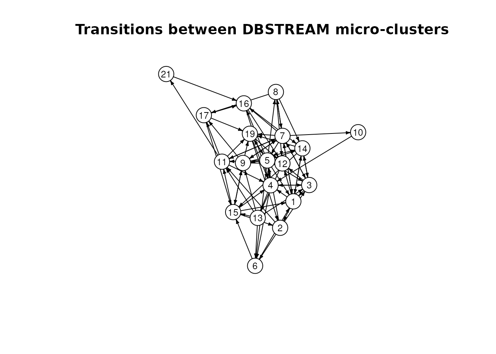

# Adding temporal structure modeling to stream clustering

## Introduction

The **stream** package provides data stream clustering algorithms
through its `DSC` interface (Hahsler et al. 2017). A clusterer groups
similar observations, but cluster membership alone does not describe the
order in which clusters occur.

`TRACDS` in **rEMM** adds a temporal model to a sequence of cluster
assignments (Hahsler and Dunham 2011). Each cluster label becomes a
state, and consecutive labels update the counts of transitions between
states. These counts can be used to estimate transition probabilities
and predict future states.

This vignette demonstrates how to connect data stream clustering
algorithms in package **stream** to
[`TRACDS()`](http://michael.hahsler.net/rEMM/reference/TRACDS-class.md)
by passing cluster assignments from each batch to the temporal model.

``` r

library(stream)
library(rEMM)
#> 
#> Attaching package: 'rEMM'
#> The following object is masked from 'package:stream':
#> 
#>     nclusters
```

## Prepare the stream and models

We use the simulated, ordered observations supplied with **rEMM**.
[`stream::DSD_Memory()`](https://rdrr.io/pkg/stream/man/DSD_Memory.html)
exposes the training data as a stream. Keep observations in their
original order.

``` r

data("EMMsim")
dsd <- DSD_Memory(EMMsim_train)
dsd
#> Memorized Stream 
#> Class: DSD_Memory, DSD_R, DSD 
#> Contains 200 data points - currently at position 1 - loop is FALSE
```

``` r

dsc <- DSC_DBSTREAM(r = 0.1, lambda = 0)
tr <- TRACDS()
```

DBSTREAM forms micro-clusters using radius `r`. We disable fading here
with `lambda = 0` to keep the example simple. Fading in the clusterer
and the temporal model are configured separately;
[`TRACDS()`](http://michael.hahsler.net/rEMM/reference/TRACDS-class.md)
also defaults to no fading.

## Update both models

For each batch, first update the clusterer and request its assignments.
Then pass the assigned labels to
[`TRACDS()`](http://michael.hahsler.net/rEMM/reference/TRACDS-class.md)
in observation order.

``` r

batch_size <- 50L
for (i in seq_len(ceiling(nrow(EMMsim_train) / batch_size))) {
  points <- get_points(dsd, n = batch_size)
  assignment <- update(dsc, points, return = "assignment")
  update(tr, as.character(assignment$.mc_id))
}
head(assignment)
#>   .class .mc_id
#> 1      6      6
#> 2     16     15
#> 3      9      9
#> 4     20     19
#> 5      5      5
#> 6     NA     NA
```

DBSTREAM’s assignment data frame contains two kinds of cluster labels:

- `.class` is the current micro-cluster index. These indices can change
  when micro-clusters are removed.
- `.mc_id` is the permanent micro-cluster identifier. Use this column as
  the state label in the temporal model.

See the [DBSTREAM
documentation](https://michael.hahsler.net/stream/reference/DSC_DBSTREAM.html)
for details of the assignment format. Converting identifiers to
character matches the label interface of
[`TRACDS()`](http://michael.hahsler.net/rEMM/reference/TRACDS-class.md).

Successive calls to `update(tr, ...)` continue the same sequence. The
last assigned state in one batch connects to the first assigned state in
the next batch, unless an unassigned observation breaks the sequence.

DBSTREAM can return `NA` for observations assigned to weak
micro-clusters. Keep these values in the label sequence:
[`TRACDS()`](http://michael.hahsler.net/rEMM/reference/TRACDS-class.md)
treats an `NA` as a sequence boundary. Removing missing labels would
incorrectly connect observations on either side of the gap.

## Inspect the temporal model

The model stores states for the labels it has observed and counts
transitions between consecutive assigned observations.
[`ntransitions()`](http://michael.hahsler.net/rEMM/reference/TRACDS-class.md)
counts distinct observed transitions, including transitions back to the
same state.

``` r

c(states = nstates(tr), transitions = ntransitions(tr))
#>      states transitions 
#>          19          82
current_state(tr)
#> [1] "13"

edges <- transitions(tr)
head(cbind(as.data.frame(edges),
  counts = transition(tr, edges, type = "counts", prior = FALSE)))
#>   from to counts
#> 1    3  1      2
#> 2    5  1      2
#> 3    6  1      1
#> 4    7  1      1
#> 5   14  1      2
#> 6   15  1      1
```

[`transition_matrix()`](http://michael.hahsler.net/rEMM/reference/transition.md)
returns a matrix with source states in rows and destination states in
columns. By default, `prior = TRUE` adds one to each transition count
before calculating probabilities. Use `prior = FALSE` to inspect the
observed counts directly.

``` r

counts <- transition_matrix(tr, type = "counts", prior = FALSE)
sum(counts)
#> [1] 142
```

The total can be smaller than the number of observations minus one
because missing assignments break the sequence.

``` r

plot(tr, vertex.size = 16, vertex.label.cex = 0.8,
  edge.arrow.size = 0.3, main = "Transitions between DBSTREAM micro-clusters")
```



Vertices are permanent micro-cluster identifiers, and directed edges
represent observed transitions. This plot shows the temporal graph; the
clusterer retains the micro-cluster centers and other spatial
information.

## Predict the next state

[`predict()`](http://michael.hahsler.net/rEMM/reference/predict.md) can
return a probability distribution over states, starting from the last
assigned state. Here we show the six most likely states one step ahead.
The default prior gives unobserved transitions a nonzero probability.

``` r

next_state <- predict(tr, n = 1, probabilities = TRUE)
head(sort(next_state, decreasing = TRUE))
#>        15         3         6         9        11         1 
#> 0.3333333 0.1666667 0.1666667 0.1666667 0.1666667 0.0000000
```

The names in this distribution are DBSTREAM micro-cluster identifiers.
They can be interpreted alongside the cluster information stored in
`dsc`.

## Start an independent sequence

Call [`reset()`](http://michael.hahsler.net/rEMM/reference/update.md)
before processing a new, independent sequence. It clears the current
state while retaining the learned states and transition counts, so no
transition is added from the end of the previous sequence to the new
one.

``` r

reset(tr)
current_state(tr)
#> [1] NA
```

Continue with the same update loop when observations from the new
sequence become available.

## Use other stream clusterers

For other `DSC` implementation in **stream**, check whether
`update(..., return = "assignment")` returns assignments and which
columns it provides. Clusterers that do not return assignments during
updates may support `predict(dsc, points, type = "micro")` after
updating. Predictions can be also used to update the temporal model,
however note that predictions assign each point to the clusters in the
updated model, which can differ from the assignments made as each point
arrived for clustering.

Before passing labels to
[`TRACDS()`](http://michael.hahsler.net/rEMM/reference/TRACDS-class.md),
ensure that a label continues to identify the same cluster across
updates. Current indices such as `.class` need a mapping to persistent
identifiers if clusters can be removed or reordered. Macro-cluster
labels also need care when reclustering changes their labels.

[`TRACDS()`](http://michael.hahsler.net/rEMM/reference/TRACDS-class.md)
does not automatically synchronize cluster deletions, merges, or
relabeling with the `DSC`. For a clusterer that changes cluster
identities, maintain a consistent label mapping or rebuild the temporal
model for the new clustering. The update loop above explicitly
coordinates the two models.

For the package’s integrated clustering and temporal model, see
[`DSC_EMM()`](http://michael.hahsler.net/rEMM/reference/DSC_EMM.md) and
the [getting started
vignette](http://michael.hahsler.net/rEMM/articles/rEMM.md).

## References

Hahsler, Michael, Matthew Bolaños, and John Forrest. 2017. “Introduction
to Stream: An Extensible Framework for Data Stream Clustering Research
with r.” *Journal of Statistical Software* 76 (14): 1–50.
<https://doi.org/10.18637/jss.v076.i14>.

Hahsler, Michael, and Margaret H. Dunham. 2011. “Temporal Structure
Learning for Clustering Massive Data Streams in Real-Time.” *Proceedings
of the 2011 SIAM International Conference on Data Mining*, 664–75.
<https://doi.org/10.1137/1.9781611972818.57>.
